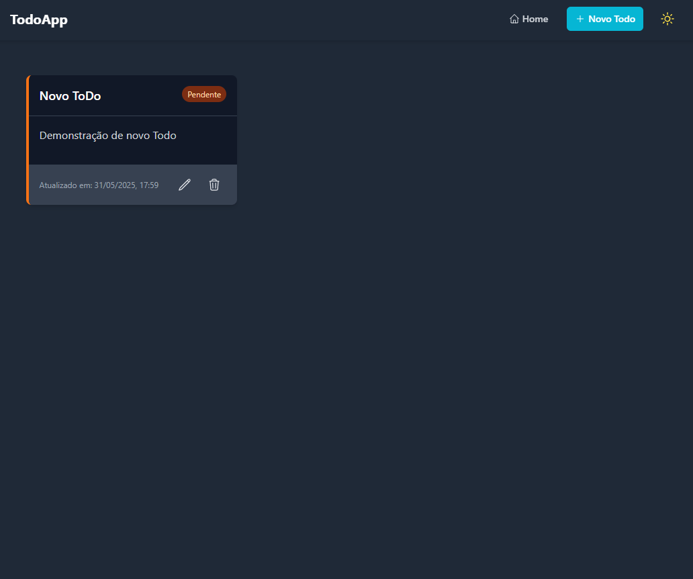

# 📝 ToDo App com React, Redux e TypeScript



## ✨ Funcionalidades Principais

- ✅ **CRUD completo** de tarefas
- 🌓 **Tema claro/escuro** com persistência
- 🏷️ Filtros por status (completas/pendentes)
- 📱 Design **totalmente responsivo**
- ⚡ Armazenamento local com **Redux Persist**
- 🛣️ Navegação com **React Router**

## 🛠️ Tecnologias Utilizadas

- 
- 
- 
- 
- 
- 

## 🚀 Como Executar Localmente

1. **Clone o repositório**

   ```bash
   git clone https://github.com/seu-usuario/todo-app.git
   cd todo-app
   ```

2. **Instale as dependências**

   ```bash
   npm install
   ```

3. **Inicie o servidor de desenvolvimento**

   ```bash
   npm start
   ```

4. **Acesse no navegador**
   ```
   http://localhost:3000
   ```

## 📦 Scripts Úteis

| Comando          | Descrição                            |
| ---------------- | ------------------------------------ |
| `npm start`      | Inicia o servidor de desenvolvimento |
| `npm run build`  | Cria uma build para produção         |
| `npm test`       | Executa os testes                    |
| `npm run format` | Formata o código com Prettier        |
| `npm run lint`   | Verifica problemas de linting        |

## 🌐 Deploy

A aplicação está disponível em:  
🔗 [https://todo-app-phi.vercel.app](https://todo-app-rust-kappa.vercel.app/)

## 🎯 Melhorias Futuras

- [ ] Autenticação de usuários
- [ ] Sincronização com backend
- [ ] Categorias/etiquetas para tarefas
- [ ] Modo offline com Service Workers

## 🤝 Como Contribuir

1. Faça um fork do projeto
2. Crie uma branch (`git checkout -b feature/nova-feature`)
3. Commit suas mudanças (`git commit -m 'Adiciona nova feature'`)
4. Push para a branch (`git push origin feature/nova-feature`)
5. Abra um Pull Request

## 📄 Licença

Este projeto está licenciado sob a licença MIT.

---

Feito com ❤️ por [Flávio Miranda](https://github.com/MannyShussan)

_(Personalize com suas informações reais de contato e links)_

### Dicas para personalização:

1. Adicione screenshots reais na pasta `public/` e referencie no README
2. Inclua um gif ou vídeo demonstrando as funcionalidades
3. Adicione badges de status (build, coverage etc) se aplicável
4. Liste as dependências principais com versões
